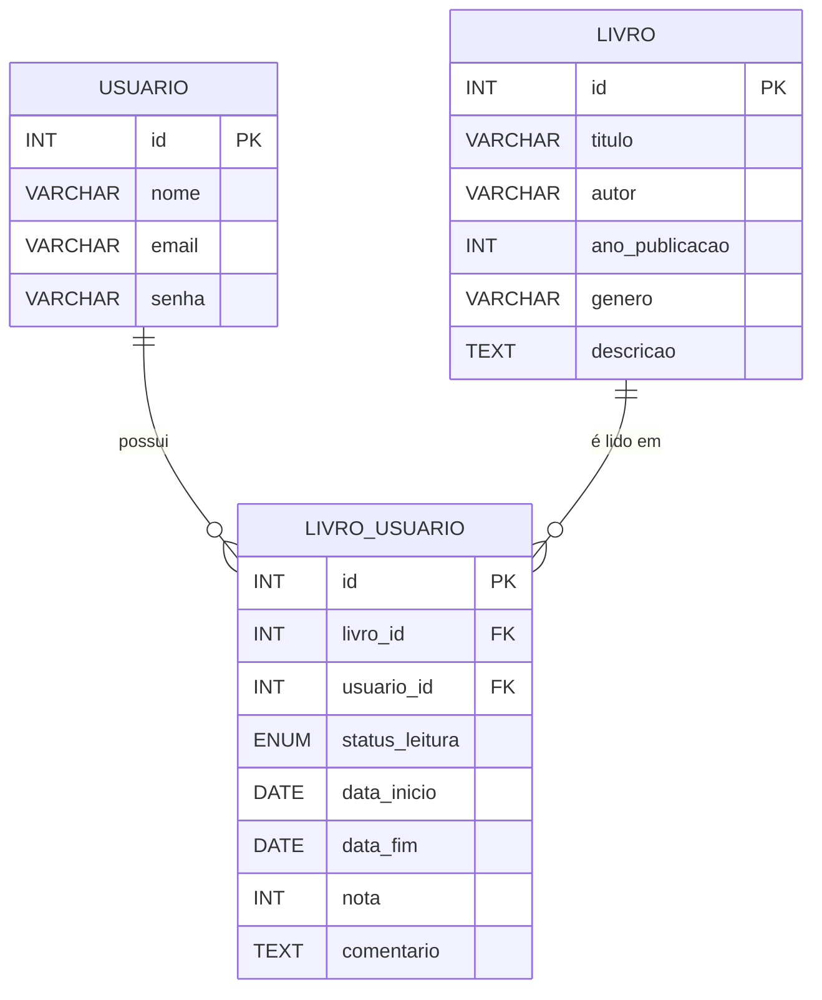

# 📚 WalterAPI

API RESTful para gerenciamento de leitura de livros, permitindo que usuários cadastrem livros, registrem leituras, definam status como *"quero ler"*, *"lendo"* ou *"lido"*, além de atribuir notas e comentários.

---

## 🔧 Tecnologias Utilizadas

- Java 21
- Spring Boot 3.4.3
- Maven
- MySQL
- Xampp
- Swagger (OpenAPI)
- IDE (Visual Studio Code, Eclipse, InteliJ)

---

## 📦 Dependências (Spring Boot 3.4.3)

Principais dependências utilizadas no projeto:

- **spring-boot-starter-web** – Para criação da API REST.
- **spring-boot-starter-data-jpa** – Integração com o banco de dados via JPA.
- **spring-boot-starter-validation** – Validação de dados com anotações.
- **spring-boot-starter-security** – Autenticação e criptografia de senha.
- **spring-boot-devtools** – Atualização automática durante o desenvolvimento.
- **MySQL Driver** – Conexão com banco de dados MySQL.
- **Lombok** – Reduz a necessidade de escrever código repetitivo como getters, setters e construtores.
- **SpringDoc OpenAPI (Swagger)** – Documentação da API.

## ⚙️ Funcionalidades

- ✅ **Evita duplicidade**: o sistema não permite cadastrar a mesma combinação de nome de usuário e título de livro mais de uma vez.
- 🔒 **Senha criptografada**: ao cadastrar um usuário, a senha é automaticamente criptografada antes de ser salva no banco de dados (seguindo boas práticas de segurança).

## 🧱 Estrutura do Projeto

O projeto segue a arquitetura em camadas e está organizado nos seguintes pacotes:

- **model**: entidades do banco de dados (Usuario, Livro, LivroUsuario).
- **dto**: objetos responsáveis por transportar dados entre a API e o banco de dados, garantindo segurança e organização na troca de informações.
- **controller**: recebe requisições HTTP e direciona para os serviços.
- **service**: contém a lógica de negócio da aplicação.
- **repository**: comunicação com o banco de dados via Spring Data JPA.
- **mapper**: faz a conversão entre entidades e DTOs.
- **config**: configurações da aplicação, como segurança (`SecurityConfig`).
- **enums**: definição de tipos enumerados usados no sistema (`StatusDeLeitura`).
- **exception**: tratamento centralizado de erros personalizados.

Essa organização facilita a escalabilidade, manutenção e clareza do projeto.


## 🗄️ Estrutura do Banco de Dados
Diagrama ER que representa as tabelas e os relacionamentos do sistema:




# 🎯 Passos para rodar o projeto
# 1. Clone o repositório
```bash
git clone https://github.com/WalterSantos08/APIWalterBibliotecav3
cd APIWalterBibliotecav3
```

# 2. Configure o banco de dados MySQL
Crie um banco com o nome abaixo (ou altere o application.properties):

```bash
CREATE DATABASE walterbiblioteca;
```

# 3. Configure o application.properties
Ajuste o arquivo com seu usuário e senha do MySQL:

```bash
spring.datasource.url=jdbc:mysql://localhost:3306/walterbiblioteca
spring.datasource.username=seu_usuario
spring.datasource.password=sua_senha

```

# 4. Execute o projeto
Você pode rodar pelo IntelliJ, Eclipse ou usando o terminal:

```bash
./mvnw spring-boot:run
```


# 📘 Acessar a Documentação da API (Swagger)

Com o projeto rodando, acesse:

```bash
http://localhost:8080/swagger-ui/index.html

```

## 🔗 Endpoints da API

### 🧑‍💻 Usuário
- `POST /api/usuario` – Cadastrar novo usuário  
- `GET /api/usuario` – Listar todos os usuários cadastrados  
- `GET /api/usuario/{id}` – Buscar usuário por ID  
- `PUT /api/usuario/{id}` – Atualizar usuário por ID  
- `DELETE /api/usuario/{id}` – Deletar usuário por ID  

### 📘 Livro
- `POST /api/livro` – Cadastrar novo livro  
- `GET /api/livro` – Listar todos os livros cadastrados  
- `GET /api/livro/{id}` – Buscar livro por ID  
- `PUT /api/livro/{id}` – Atualizar livro por ID  
- `DELETE /api/livro/{id}` – Deletar livro por ID  

### 📖 Leitura (LivroUsuario)
- `POST /api/livro-usuario` – Relacionar livro a um usuário  
- `GET /api/livro-usuario` – Listar todas as leituras registradas  
- `GET /api/livro-usuario/{id}` – Buscar leitura por ID  
- `PUT /api/livro-usuario/{id}` – Atualizar status de leitura  
- `DELETE /api/livro-usuario/{id}` – Remover relação de leitura 

---

## 👤 Autor

<p align="center">
  <a href="https://github.com/WalterSantos08">
    
    <br>
    <strong>Walter Santos</strong>
  </a>
</p>
