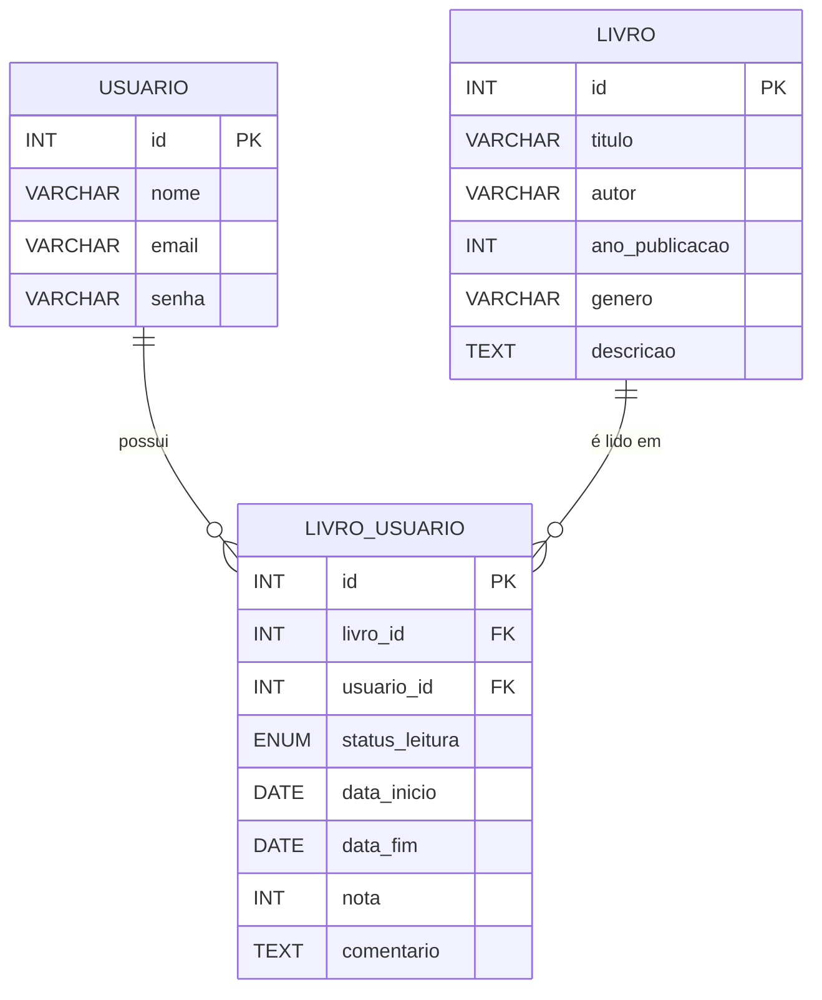

# 📚 WalterAPI

API RESTful para gerenciamento de leitura de livros, permitindo que usuários cadastrem livros, registrem leituras, definam status como *"quero ler"*, *"lendo"* ou *"lido"*, além de atribuir notas e comentários.

---

## 🔧 Tecnologias Utilizadas

- Java 17+
- Spring Boot 3.4.x
- Maven
- MySQL
- Lombok
- Swagger (OpenAPI)
- Spring Data JPA
- Jakarta Bean Validation

---

## 🗂️ Estrutura do Projeto

## 🚀 Como Executar o Projeto Localmente

### 🧑‍💻 Usuário
- `POST /api/usuario` – Cadastrar novo usuário  
- `GET /api/usuario` – Listar todos os usuários  
- `PUT /api/usuario/{id}` – Atualizar usuário por ID  
- `DELETE /api/usuario/{id}` – Deletar usuário por ID  

### 📘 Livro
- `POST /api/livro` – Cadastrar novo livro  
- `GET /api/livro` – Listar todos os livros  
- `PUT /api/livro/{id}` – Atualizar livro por ID  
- `DELETE /api/livro/{id}` – Deletar livro por ID  

### 📖 Leitura (LivroUsuario)
- `POST /api/livro-usuario` – Relacionar livro a um usuário  
- `GET /api/livro-usuario` – Listar todas as leituras  
- `PUT /api/livro-usuario/{id}` – Atualizar status de leitura  
- `DELETE /api/livro-usuario/{id}` – Remover relação de leitura  

### 🎯 Status de Leitura
Valores permitidos para o campo `statusLeitura`:
- `QUERO_LER`
- `LENDO`
- `LIDO`

### 🛠️ Tratamento de Erros
A API trata os erros mais comuns com mensagens claras:
- `400 Bad Request` – Dados inválidos  
- `404 Not Found` – Recurso inexistente  
- `409 Conflict` – Duplicidade (ex: mesmo livro para o mesmo usuário)

---

### 👤 Autor
Desenvolvido por [Walter Santos](https://github.com/WalterSantos08)
